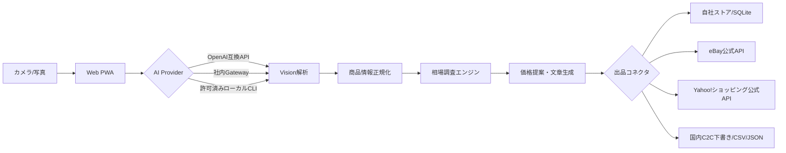

# SnapList AI Marketplace

写真を撮るだけで、商品候補・状態・説明文・相場レンジ・推奨価格を生成し、複数マーケット向けの出品データへ変換するオープンソース基盤です。

> **現在の実装範囲**: Web/PWAは公開デモとして動作します。自社ストアはローカル保存とFastAPI/SQLiteで実出品できます。eBayとYahoo!ショッピングは公式APIコネクタを用意しています。メルカリ、ラクマ、個人向けYahoo!オークションは一般公開の出品APIが確認できないため、安全な下書き生成・CSV/JSON出力・公式出品画面への引き渡し方式です。


## できること

- iPhone/スマートフォンのカメラ撮影または写真アップロード
- AI Visionゲートウェイによる商品名、ブランド、カテゴリ、状態、特徴の抽出
- 複数相場データから中央値、レンジ、早期売却価格、利益重視価格を算出
- 日本語の商品タイトル・説明・注意事項を自動生成し、画面上で訂正
- 自社ストアへ出品、eBay/Yahoo!ショッピング公式APIへ接続
- メルカリ/ラクマ/Yahoo!オークション向けに入力済み下書きとCSV/JSONを生成
- PWAとしてiPhoneホーム画面へ追加可能
- OpenAI互換API、社内AIゲートウェイ、ローカルCLIプロバイダーを切替可能

## 公開デモ

Cloudflare PagesのURLはGitHub反映時に自動作成されます。APIキーなしでもブラウザ内デモ解析、編集、ローカル保存、JSON/CSV出力が動作します。

## アーキテクチャ



詳細は [`docs/architecture.md`](docs/architecture.md)、調査結果は [`docs/research.md`](docs/research.md)、初期設定は [`docs/setup.md`](docs/setup.md) を参照してください。

## ローカル起動

```bash
cp .env.example .env
python -m venv .venv
source .venv/bin/activate
pip install -e '.[dev]'
uvicorn app.main:app --reload
```

別ターミナルで静的Webを配信します。

```bash
python -m http.server 3000 -d web
```

`http://localhost:3000` を開き、設定画面のAPI URLを `http://localhost:8000` にします。

## AIプロバイダー

既定はAPIキー不要のデモモードです。本番では `.env` に以下を設定します。

```dotenv
AI_PROVIDER=openai-compatible
AI_GATEWAY_URL=https://api.openai.com/v1
AI_GATEWAY_API_KEY=...
AI_MODEL=gpt-4.1-mini
```

月額契約済みCLIを使う場合は、ローカル環境に限り `ENABLE_LOCAL_CLI_PROVIDER=true` と `AI_CLI_COMMAND` を設定します。任意コマンド実行を避けるため、本番ホスティングでは無効のままにしてください。

## 出品モード

| プラットフォーム | モード | 備考 |
|---|---|---|
| 自社ストア | 自動 | SQLite保存、API実装済み |
| eBay | 自動 | OAuth、出品ポリシー、画像URLが必要 |
| Yahoo!ショッピング | 自動 | ストア契約、OAuth、Seller IDが必要 |
| メルカリ | アシスト | 下書き・画像・説明・価格を生成 |
| ラクマ | アシスト | 下書き・画像・説明・価格を生成 |
| Yahoo!オークション個人 | アシスト | 下書き・CSV/JSONを生成 |

## iPhone

このWebアプリはPWA対応です。Safariで開き、共有メニューから「ホーム画面に追加」するとカメラ起動対応のアプリとして利用できます。App Store配布用のCapacitorラッパー設定は `mobile/` に含まれています。

## テスト

```bash
ruff check app tests
pytest
```

GitHub Actionsはpush/PR/手動実行でlint、型に依存しないコンパイル確認、APIテスト、静的Web検査を行い、Webバンドルをartifactとして保存します。

## 本番に必要なもの

- Cloudflare Pages: 静的PWAの公開（自動化済み）
- FastAPIのホスティング先: Render/Fly.io/Cloud Run等、または社内環境
- AIプロバイダーのAPIキーまたは社内ゲートウェイ
- 自動出品する各公式APIのOAuth認証情報
- 公開画像ストレージ（eBay等が外部画像URLを要求する場合）
- App Store配布時のみApple Developer Program、署名証明書、審査対応

## セキュリティ

SecretsはGitHubへコミットしません。ブラウザ自動操作によるログイン・CAPTCHA回避・非公開APIの利用は実装していません。公式APIがないサービスは必ずアシストモードになります。

## License

MIT
