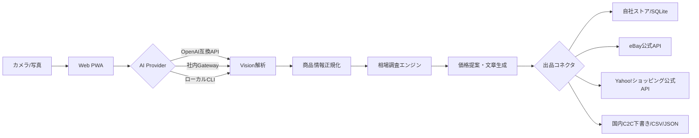

# SnapList AI Marketplace

写真を撮るだけで、商品候補・状態・説明文・相場レンジ・推奨価格を生成し、複数マーケット向けの出品データへ変換するオープンソース基盤です。

> **実装範囲**: Web/PWAはAPIキーなしでも動作します。自社ストアはFastAPI/SQLiteで実出品できます。eBayとYahoo!ショッピングは公式APIコネクタを用意します。メルカリ、ラクマ、個人向けYahoo!オークションは一般公開の出品APIが確認できないため、安全な下書き生成・CSV/JSON出力・公式画面への引き渡し方式です。

## できること

- iPhone/スマートフォンのカメラ撮影または写真アップロード
- AI Visionによる商品名、ブランド、カテゴリ、状態、特徴の抽出
- 相場レンジ、早期売却価格、推奨価格、利益重視価格の算出
- 日本語の商品タイトル・説明・注意事項の生成と訂正
- 自社ストア、eBay、Yahoo!ショッピング向けコネクタ
- メルカリ、ラクマ、Yahoo!オークション向け入力済み下書き
- JSON/CSV出力、PWAインストール、iPhone用Capacitor土台

## アーキテクチャ



## ローカル起動

```bash
cp .env.example .env
python -m venv .venv
source .venv/bin/activate
pip install -e '.[dev]'
uvicorn app.main:app --reload
python -m http.server 3000 -d web
```

WebのAPI設定に `http://localhost:8000` を保存します。API未接続時はブラウザ内デモ解析へ切り替わります。

## 出品モード

| プラットフォーム | モード |
|---|---|
| 自社ストア | 自動 |
| eBay | 公式API |
| Yahoo!ショッピング | 公式API |
| メルカリ | 入力済み下書き |
| ラクマ | 入力済み下書き |
| Yahoo!オークション個人 | 入力済み下書き |

非公開API、パスワード保存、CAPTCHA/MFA回避は実装しません。Secretsは環境変数に置きます。

## License
MIT
