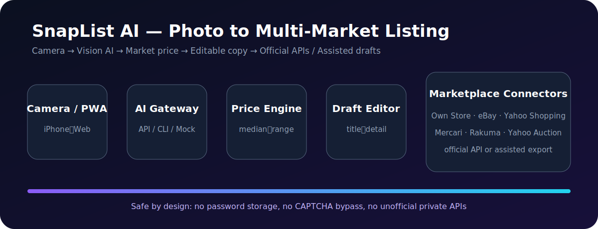
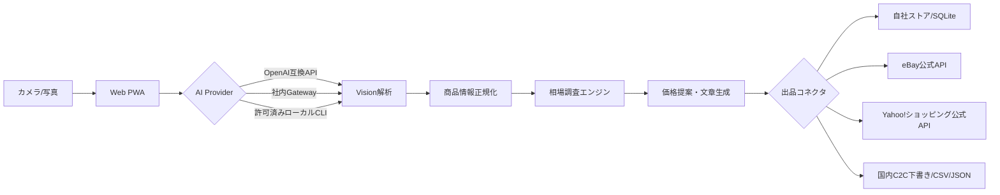

# SnapList AI Marketplace

写真を撮るだけで、商品候補・状態・説明文・相場レンジ・推奨価格を生成し、複数マーケット向けの出品データへ変換するオープンソース基盤です。

**公開Web/PWA:** https://snaplist-ai-marketplace.pages.dev



> **実装範囲**: Web/PWAはAPIキーなしでも動作します。自社ストアはFastAPI/SQLiteで実出品できます。eBayは公式Inventory APIコネクタを実装しています。Yahoo!ショッピングは公式APIへ接続するための設定とデータ変換を用意しています。メルカリ、ラクマ、個人向けYahoo!オークションは一般公開の出品APIが確認できないため、安全な下書き生成・CSV/JSON出力・公式画面への引き渡し方式です。

## できること

- iPhone/スマートフォンのカメラ撮影または写真アップロード
- AI Visionによる商品名、ブランド、カテゴリ、状態、特徴の抽出
- 相場レンジ、早期売却価格、推奨価格、利益重視価格の算出
- 日本語の商品タイトル・説明・注意事項の生成と訂正
- 自社ストア、eBay、Yahoo!ショッピング向けコネクタ
- メルカリ、ラクマ、Yahoo!オークション向け入力済み下書き
- JSON/CSV出力、PWAインストール、iPhone用Capacitor土台
- API停止時にも動くブラウザ内デモモード

## アーキテクチャ



詳細:
- [システム構成](docs/architecture.md)
- [初期設定](docs/setup.md)
- [既存OSS・API調査](docs/research.md)
- [iPhoneラッパー](mobile/README.md)

## ローカル起動

```bash
cp .env.example .env
python -m venv .venv
source .venv/bin/activate
pip install -e '.[dev]'
uvicorn app.main:app --reload
```

別ターミナル:

```bash
python -m http.server 3000 -d web
```

`http://localhost:3000` を開き、API設定に `http://localhost:8000` を保存します。API未接続時はブラウザ内デモ解析へ切り替わります。

## AIゲートウェイ

```dotenv
AI_PROVIDER=openai-compatible
AI_GATEWAY_URL=https://api.openai.com/v1
AI_GATEWAY_API_KEY=...
AI_MODEL=gpt-4.1-mini
```

社内OpenAI互換ゲートウェイへ差し替え可能です。月額契約済みCLIを使う場合はローカル環境だけで許可し、本番サーバーでは任意コマンド実行を無効にします。ブラウザへAPIキーは置きません。

## 出品モード

| プラットフォーム | モード | 条件 |
|---|---|---|
| 自社ストア | 自動 | SQLite、将来PostgreSQLへ移行可能 |
| eBay | 自動 | OAuth、出品ポリシー、公開画像URL |
| Yahoo!ショッピング | 公式連携準備 | ストア契約、OAuth、Seller ID |
| メルカリ | アシスト | 入力済み下書き・画像・JSON/CSV |
| ラクマ | アシスト | 入力済み下書き・画像・JSON/CSV |
| Yahoo!オークション個人 | アシスト | 入力済み下書き・JSON/CSV |

## iPhone

公開URLをSafariで開き、共有メニューの「ホーム画面に追加」でカメラ対応PWAとして利用できます。App Store配布用のCapacitor設定は `mobile/` にあります。実配布時だけApple Developer Program、Bundle ID、署名、プライバシー表示、審査が必要です。

## テストとCI

```bash
ruff check app tests
pytest
```

GitHub Actionsはpush、PR、手動実行に対応し、lint、Pythonコンパイル、APIテスト、静的PWA検査を行い、Webバンドルをartifactとして保存します。

## セキュリティ

SecretsはGitHubへコミットしません。マーケットプレイスのパスワード保存、CAPTCHA/MFA回避、非公開API、規約違反になり得るブラウザ自動操作は実装していません。AI推定の型番・真贋・状態・付属品は公開前に編集画面で確認します。

## License

MIT
