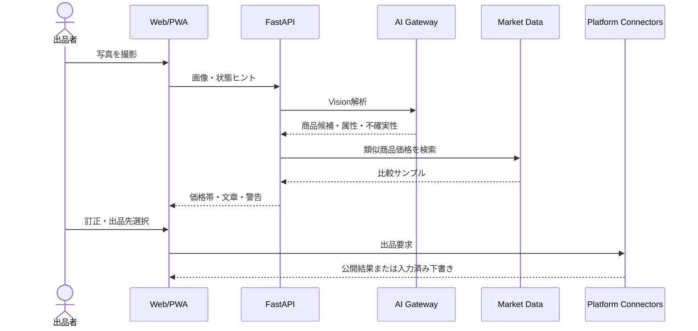

# Architecture

## 目的
写真入力から商品情報を正規化し、相場の根拠を示しながら、プラットフォーム別の出品形式へ変換することが目的です。公式APIがないサービスを無理に自動操作せず、公開APIコネクタとアシストコネクタを同じインターフェースで扱います。

## コンポーネント

- `web/`: インストール可能な静的PWA。API停止時もデモ解析・編集・エクスポートが可能。
- `app/main.py`: FastAPI、AIゲートウェイ、価格計算、SQLite自社ストア、出品コネクタ。
- AI Gateway: OpenAI互換Chat Completions形式。社内プロキシへ差替可能。
- Price Engine: 複数価格の中央値を基準に早期売却・推奨・プレミアム価格を算出。
- Connectors: eBay公式API、自社ストア、Yahoo!ショッピング準備、国内C2Cアシスト。
- `mobile/`: Capacitorで同一PWAをiOSネイティブコンテナへ格納する土台。

## データ
初版はSQLiteです。`listings` テーブルへ正規化済みドラフトをJSON保存します。本番ではPostgreSQL、画像はS3/R2、非同期処理はキューへ移行できます。

## セキュリティ境界
- APIキーはサーバー環境変数のみ。
- Marketplaceのパスワードは保持しない。
- MFA/CAPTCHAを回避しない。
- AI推定の型番、真贋、状態は人が確認できる編集画面を必須とする。
- CLIプロバイダーはローカル専用、allowlist運用を前提とする。

## 拡張順序
1. eBay Browse APIから実価格サンプル取得。
2. Yahoo!ショッピング商品検索と商品登録APIを接続。
3. R2画像アップロードと署名URL。
4. PostgreSQL、ユーザー認証、在庫同期、売却時の他サイト取り下げ。
5. App Store向けCapacitorビルド、Push通知、バーコード/OCR。
